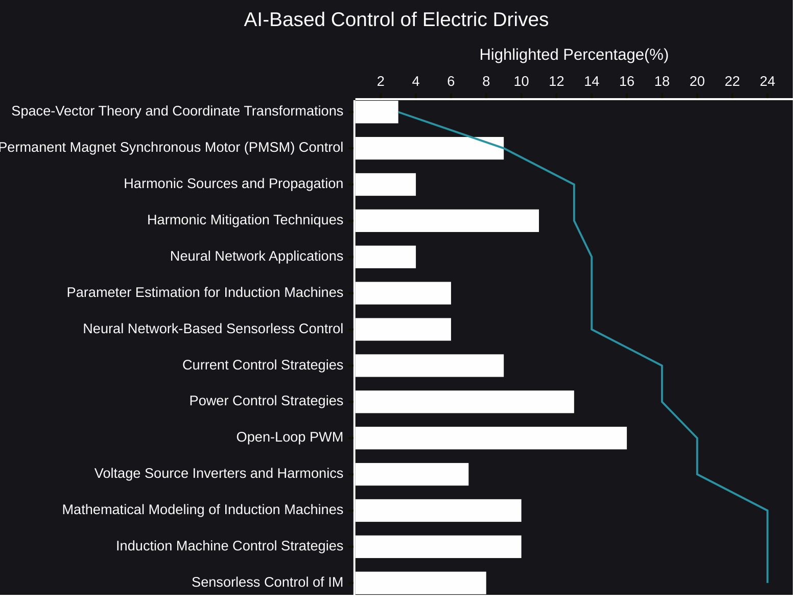

# AI-Based Control of Electric Drives plus AI Reasoning
The hum of a motor, the whir of a turbine, the precise movements of robotic arms – electric drives are the unsung heroes powering our modern world. From industrial automation to electric vehicles, these systems demand increasingly sophisticated control to achieve peak performance, efficiency, and reliability.  And now, a new era is dawning: the age of AI-based control.

- 🧠[AI Reasoning](https://viadean.notion.site/AI-Based-Control-of-Electric-Drives-plus-AI-Reasoning-1921ae7b9a3280c3b365caaeac1a04bf?pvs=4)
#### 🗜️Highlights

Traditional control methods, while effective in many scenarios, often struggle with the complexities of modern drive systems.  Nonlinearities, parameter variations, and unpredictable disturbances can challenge even the most carefully tuned controllers.  This is where the power of Artificial Intelligence comes into play.  AI, with its ability to learn, adapt, and generalize, offers a revolutionary approach to electric drive control.

Imagine a drive system that can learn its own optimal operating parameters, adapting in real-time to changes in load, temperature, or even component wear.  This is the promise of AI.  Neural networks, for example, can be trained to recognize complex patterns in sensor data and make highly accurate predictions about the drive's behavior.  This allows for more precise control, improved energy efficiency, and reduced downtime.

Sensorless control, a critical technique for many applications, also benefits significantly from AI.  Traditional sensorless methods, which estimate rotor position without physical sensors, can be sensitive to noise and parameter variations.  AI-based approaches, on the other hand, can learn the intricate relationships between measurable quantities and rotor position, leading to more robust and reliable sensorless operation.  This opens doors for smaller, more cost-effective drive systems in a wider range of environments.

But the potential of AI in electric drives extends beyond just improved control.  AI algorithms can also be used for:

- **Fault Detection and Diagnostics:** AI can learn the normal operating patterns of a drive system and quickly identify anomalies that may indicate a developing fault. This enables predictive maintenance, preventing costly breakdowns and maximizing system uptime.
- **Optimization:** AI can optimize the performance of entire drive systems, taking into account factors like energy consumption, production throughput, and component lifespan. This can lead to significant cost savings and improved overall efficiency.
- **Design and Simulation:** AI can assist in the design and simulation of electric drives, helping engineers to create more efficient and robust systems.

The integration of AI into electric drive control is not without its challenges.  Training AI models requires large amounts of high-quality data, and ensuring the reliability and safety of AI-based controllers is crucial.  However, the rapid advancements in AI technology, coupled with the increasing demand for high-performance electric drives, are driving innovation in this exciting field.

We are on the cusp of a new revolution in electric drive technology.  AI-based control is poised to transform the way we design, operate, and maintain these critical systems, ushering in an era of unprecedented precision, efficiency, and intelligence.  The hum of the motor is evolving, becoming a symphony of intelligent control.
