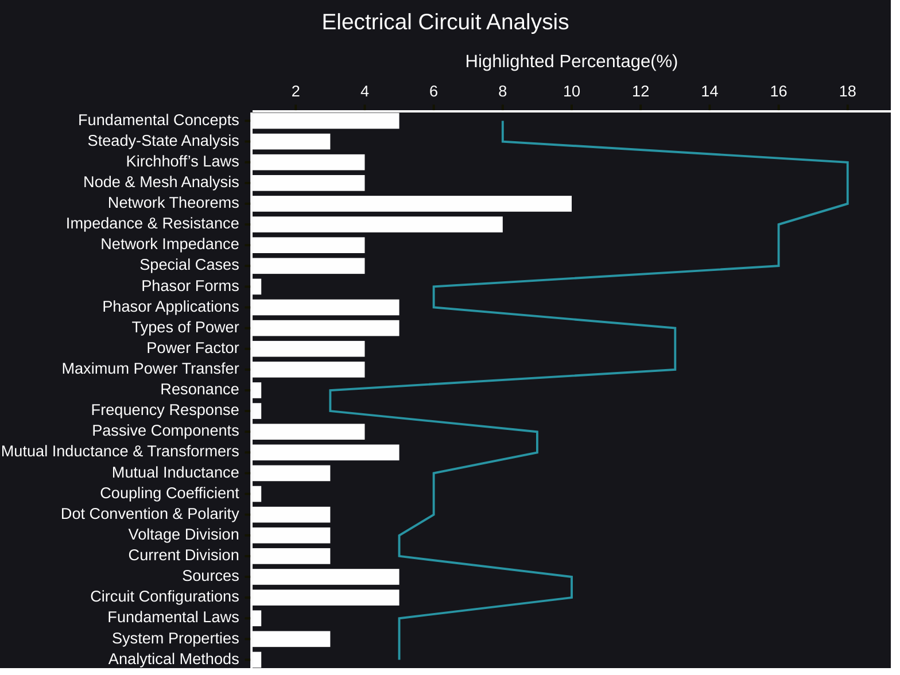

# Electrical Circuit Analysis plus AI Reasoning
Electrical circuit analysis can seem daunting at first, a complex web of interconnected components and abstract concepts.  However, beneath the surface lies a beautiful and logical framework that governs the behavior of electrical systems, from the simplest flashlight to the most sophisticated supercomputer.  Instead of a laundry list of terms, let's explore the core ideas that form the foundation of this fascinating field.
- [AI Reasoning](https://viadean.notion.site/Electrical-Circuit-Analysis-plus-AI-Reasoning-19b1ae7b9a3280808007da0eed996994)
### 🗜️Highlights

Imagine a bustling city.  Current flows like traffic, sometimes smoothly, sometimes encountering resistance.  Voltage acts like the pressure that drives this flow, and power represents the energy being used.  Just like a city's infrastructure, circuits have different elements – resistors that impede the flow, capacitors that store energy like reservoirs, and inductors that act like traffic roundabouts, temporarily storing energy in a magnetic field.

Understanding how these elements interact is key.  Kirchhoff's laws, like the rules of the road, dictate how current and voltage behave at junctions and loops within the circuit.  These laws, combined with powerful analysis techniques, allow us to predict and control the behavior of even the most intricate circuits.  Think of nodal and mesh analysis as different routes to map the city's traffic flow, while theorems like superposition, Thevenin, and Norton offer shortcuts to simplify complex scenarios.

AC circuits introduce a dynamic element – the sinusoidal nature of voltage and current.  This adds a new dimension to our analysis, requiring the use of phasors, mathematical tools that represent these oscillating quantities.  We encounter concepts like impedance and admittance, which generalize resistance to AC circuits, and delve into the intricacies of power – real, reactive, and apparent – and the crucial role of power factor.

Resonance, a phenomenon where circuits respond strongly to specific frequencies, is like finding the city's "sweet spot" where everything flows smoothly.  Understanding frequency response allows us to design circuits that filter signals, amplify specific frequencies, and perform a myriad of other essential tasks.

The journey through electrical circuit analysis is one of discovery.  It's about understanding the fundamental principles that govern the behavior of electricity, learning the tools and techniques to analyze and design circuits, and ultimately, gaining the ability to shape the world around us through the power of electrical engineering.  It's a challenging but rewarding field, one that opens doors to countless innovations and technological advancements.
