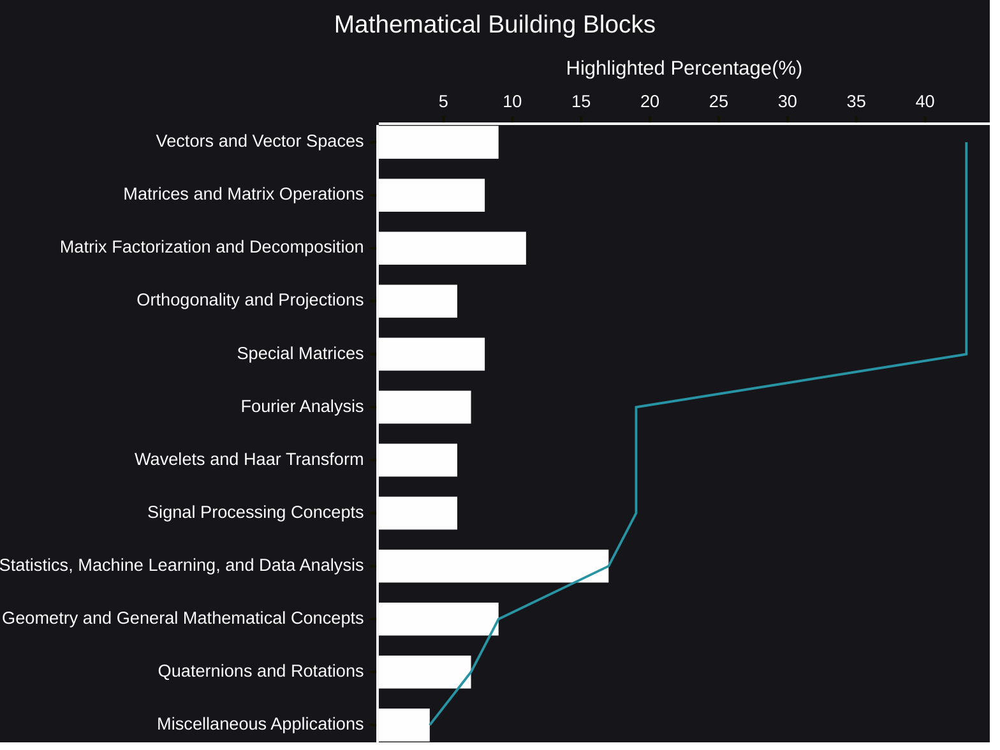

# Mathematical Building Blocks plus AI Reasoning
Mathematics is the silent architect behind much of the technology we rely on today.  It's the language of data, the logic of algorithms, and the key to unlocking insights hidden within complex datasets.  This post explores some of the essential mathematical concepts—the "building blocks"—that underpin fields like data science, machine learning, signal processing, and more.
- [AI Reasoning](https://viadean.notion.site/Mathematical-Building-Blocks-plus-AI-Reasoning-1961ae7b9a3280df978fd516b1f663e9?pvs=4)
## 🗜️Highlights

These concepts aren't just abstract ideas; they are powerful tools.  They enable us to compress images, analyze financial markets, predict weather patterns, and even understand the human brain.  A solid grasp of these mathematical fundamentals is crucial for anyone seeking to navigate the increasingly data-driven world.

Imagine trying to build a skyscraper without understanding the principles of structural engineering.  Similarly, attempting to tackle complex data science problems without a foundation in linear algebra, calculus, and statistics is likely to lead to shaky results.  These "building blocks" provide the necessary framework for constructing robust and reliable solutions.

From the elegance of matrix operations to the power of Fourier transforms, each concept plays a vital role.  Linear algebra provides the tools to manipulate and analyze high-dimensional data.  Calculus allows us to model change and optimize processes.  Statistics gives us the framework for understanding uncertainty and drawing meaningful conclusions from data.  And concepts like rotations, quaternions, and wavelet transforms open doors to working with 3D data, signals, and images.

This post isn't exhaustive, but it highlights some of the most important mathematical concepts.  It's an invitation to explore, to delve deeper, and to discover the beauty and utility of mathematics in shaping our understanding of the world.  These "building blocks" are the foundation upon which innovation is built, and mastering them is the first step towards unlocking the potential of data.
