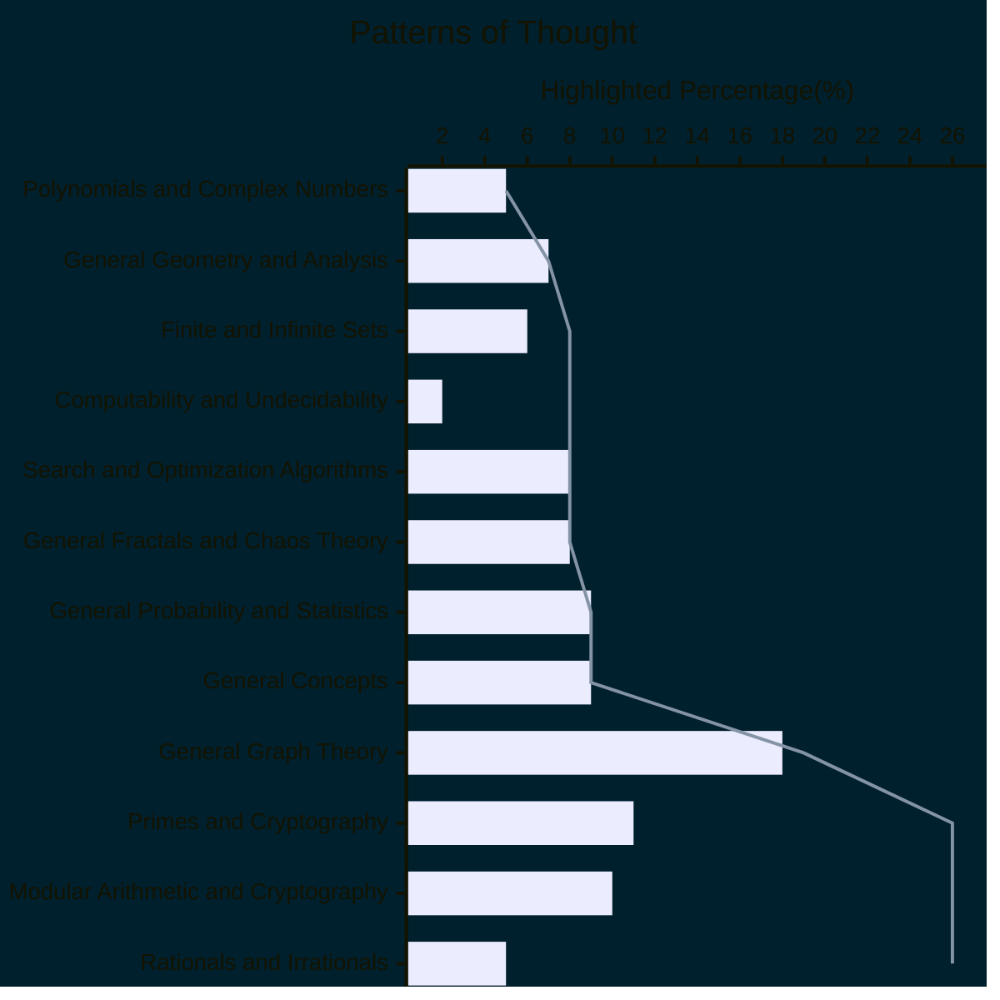

# Patterns of Thought plus AI Reasoning
Mathematics, at its heart, is the study of patterns.  Not just the visual kind we see in a kaleidoscope, but the deeper, more abstract patterns that govern the very fabric of reality.  From the predictable dance of prime numbers to the chaotic beauty of fractals, mathematics provides the language to describe, analyze, and even predict these patterns.  It's a way of thinking, a lens through which we can perceive the hidden order in the universe.

🧠[AI Reasoning](https://viadean.notion.site/Patterns-of-Thought-plus-AI-Reasoning-1921ae7b9a32808380cecab42a20c6e8?pvs=4)
#### 🗜️Highlights

This exploration of mathematical thought isn't just about dry formulas and abstract theorems. It's about understanding the building blocks of logic, the tools we use to reason, and the frameworks we create to model the world around us.  Consider the elegance of prime factorization, the way any whole number can be uniquely broken down into its prime constituents.  This fundamental theorem underpins much of modern cryptography, the art of secure communication.  Or think about the concept of infinity, a mind-bending idea that has captivated mathematicians for centuries, leading to profound insights about the nature of sets and numbers.

But mathematics isn't confined to the theoretical realm.  It's a practical discipline, a powerful engine for innovation.  Algorithms, the step-by-step instructions that guide computers, are born from mathematical principles.  From the simple search algorithm that helps you find information online to the complex optimization algorithms that power logistics and finance, mathematics is the driving force behind technological progress.  Even the seemingly random world of probability and statistics relies on rigorous mathematical foundations, allowing us to make sense of uncertainty and predict future events.

And then there's the sheer beauty of mathematics.  The intricate geometry of fractals, like the Mandelbrot set, reveals a world of infinite complexity hidden within simple equations.  The elegant proofs that demonstrate the truth of mathematical statements are works of art in their own right.  Mathematics is a testament to the power of human thought, our ability to abstract, generalize, and discover the hidden connections that bind everything together.

So, let us delve into these "Patterns of Thought."  Let us explore the interconnectedness of mathematical concepts, from the fundamental properties of numbers to the sophisticated tools of analysis and computation. Let us appreciate the beauty and power of mathematics, a language that allows us to decipher the secrets of the universe and shape the world we live in.  This journey through the landscape of mathematics is a journey into the very heart of reason, a testament to the boundless capacity of the human mind.
