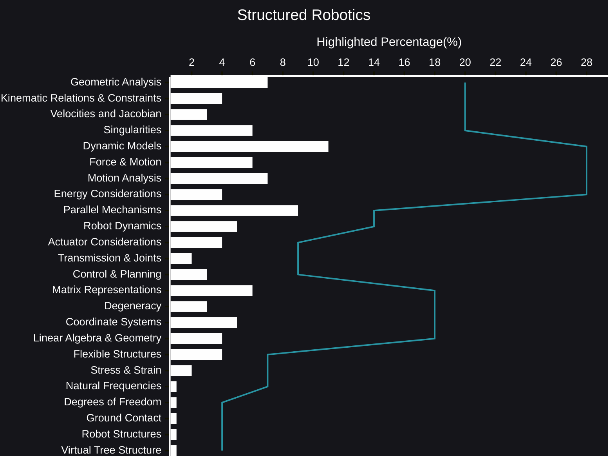

# Structured Robotics plus AI Reasoning
Robotics is a field built on a foundation of interconnected concepts.  It's not enough to simply know the names of things; understanding how they relate is key to designing, building, and controlling robots effectively.  This post offers a structured overview of the essential vocabulary of robotics, highlighting the relationships between core ideas and providing a framework for navigating the complex landscape of movement.

- [AI Reasoning](https://viadean.notion.site/Structured-Robotics-plus-AI-Reasoning-1981ae7b9a328047894edd91e355606d)
## 🗜️Highlights

Imagine trying to build a complex machine without a blueprint.  Similarly, tackling robotics challenges without a structured understanding of its fundamental concepts can lead to confusion and inefficiency.  This "structured vocabulary" acts as that blueprint, guiding us through the key areas of kinematics, dynamics, and control.

Kinematics, the study of motion, provides the language for describing how robots move.  From the transformations that define a robot's position and orientation to the intricate dance of multiple joints, kinematics allows us to map the robot's configuration and plan its trajectory.  It encompasses everything from the geometry of robot arms to the analysis of singularities – those tricky configurations where a robot might lose its ability to move freely.

Dynamics, on the other hand, deals with the forces that cause motion.  It's where we consider inertia, friction, and the complex interplay of forces that govern a robot's behavior.  Understanding dynamics is crucial for creating realistic simulations, designing robust control systems, and predicting how a robot will respond to external influences.  It involves concepts like the Lagrangian and Newton-Euler formulations, and the analysis of flexible links and virtual systems.

Control is the bridge between desired behavior and actual performance.  It's the art of orchestrating the robot's movements to achieve a specific task.  Control systems rely on a deep understanding of both kinematics and dynamics, using feedback and algorithms to guide the robot's actions and compensate for uncertainties.

This structured approach to robotics vocabulary isn't just about memorizing terms; it's about building a mental model of how these concepts fit together.  It's about recognizing the connections between seemingly disparate ideas and using that knowledge to solve real-world problems.  Whether you're designing a robotic arm for surgery or programming a self-driving car, this structured understanding will be your most valuable tool.  It's the foundation upon which innovation in robotics is built.
