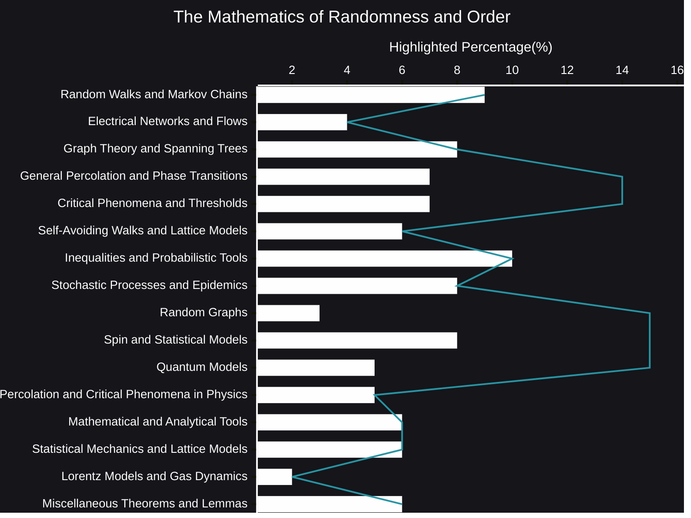

# The Mathematics of Randomness and Order plus AI Reasoning
The world around us is a fascinating tapestry woven from threads of both randomness and order. From the intricate branching of a tree to the seemingly chaotic fluctuations of stock prices, we observe patterns emerging from the unpredictable, and vice versa.  Understanding this delicate dance between chance and structure is a central challenge in mathematics, leading to a rich and beautiful field of study.

- [AI Reasoning](https://viadean.notion.site/The-Mathematics-of-Randomness-and-Order-plus-AI-Reasoning-1991ae7b9a32808b82affd13d40ca99b)

### 🗜️Highlights

The "Mathematics of Randomness and Order" delves into this very interplay. It provides the tools and frameworks to analyze systems where uncertainty reigns, yet where predictable behaviors and structures can arise.  Think of a gas expanding to fill a container: the individual motions of the molecules are random, yet the overall pressure and temperature are remarkably consistent.  This field seeks to explain such phenomena, uncovering the hidden order within apparent chaos.

This area of mathematics isn't just about describing randomness; it's about quantifying it, modeling it, and ultimately, harnessing it.  It explores how random processes evolve over time, how networks of interconnected elements behave, and how phase transitions can dramatically alter the properties of a system.  It grapples with questions of scale, investigating how microscopic randomness can give rise to macroscopic order, and how this order can break down under certain conditions.

From the elegant patterns of crystal growth to the spread of epidemics, the principles of randomness and order are at play.  This field provides the language and techniques to model these diverse phenomena, offering insights into their behavior and even allowing us to predict their future evolution. It's a field brimming with open questions and exciting challenges, constantly pushing the boundaries of mathematical thought and offering powerful tools for understanding our complex world.  It's a journey into the heart of uncertainty, where the unexpected often reveals the most profound truths.
