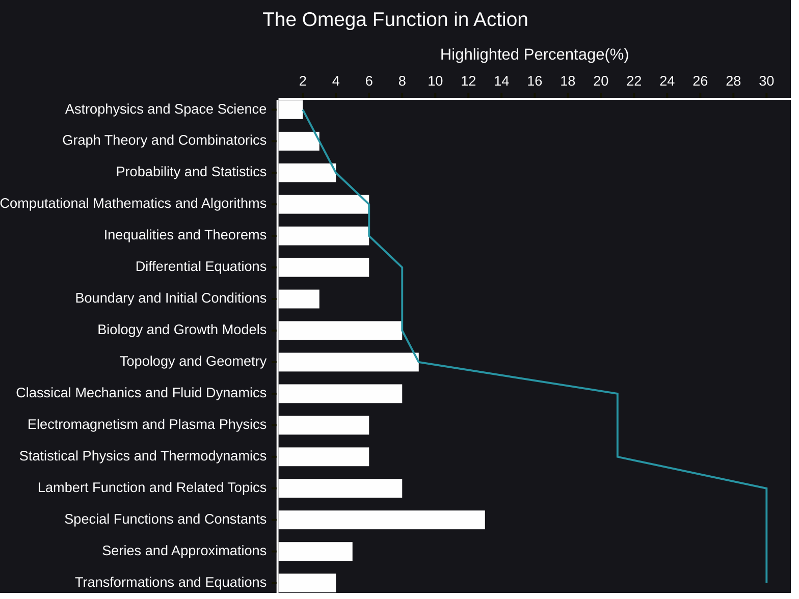

# The Omega Function in Action plus AI Reasoning
The Wright ω function, often simply called the omega function, might seem like an obscure mathematical entity at first glance.  However, its presence quietly permeates various corners of science and engineering, revealing surprising connections between seemingly disparate phenomena.  It's not just an abstract concept confined to textbooks; it's a powerful tool with real-world implications.

- 🧠[AI Reasoning](https://viadean.notion.site/The-Omega-Function-in-Action-plus-AI-Reasoning-1951ae7b9a3280afa94dffd24a639ff2?pvs=4)
- 🗜️Highlights

So, what exactly *is* the omega function?  It's defined as the solution to the transcendental equation $*ωe^ω = z*$.  While this definition might appear intimidating, it's the key to unlocking its diverse applications.  Think of it as a decoder, transforming complex relationships into manageable forms.

One of the most striking examples of the omega function in action lies in the realm of *delay differential equations*. These equations, which model systems where the rate of change depends not only on the present state but also on past states, are notoriously difficult to solve.  The omega function steps in to provide analytical solutions in certain cases, offering a glimpse into the dynamics of systems with memory, from population growth with time lags to the spread of epidemics.

Beyond differential equations, the omega function pops up in *number theory*, specifically in the analysis of the asymptotics of the Bell numbers, which count the number of ways to partition a set.  It even finds its way into the study of *special functions* themselves, playing a crucial role in the development of series expansions and approximations.

But the omega function's influence doesn't stop at pure mathematics.  It also makes an appearance in *physics*, particularly in the context of certain quantum mechanical problems and in the analysis of some heat transfer phenomena.  It has also found applications in *biology*, for example, in the study of enzyme kinetics and the modeling of certain biological processes.  The Lindley distribution in statistics also has connections to the Lambert W function.

What's truly remarkable about the omega function is its ability to bridge seemingly unrelated fields.  It acts as a unifying thread, revealing underlying mathematical structures that connect diverse areas of study.  This underscores the interconnectedness of mathematics and the sciences, showing how a single mathematical function can provide insights into a wide range of natural and engineered systems.

While the omega function may not be as widely known as other mathematical functions, its impact is undeniable.  It's a testament to the power of mathematical abstraction, demonstrating how seemingly esoteric concepts can have profound and practical applications.  As we continue to explore the intricate relationships within our world, the omega function will undoubtedly play an increasingly important role, quietly working behind the scenes to unveil hidden connections and deepen our understanding of the universe.
