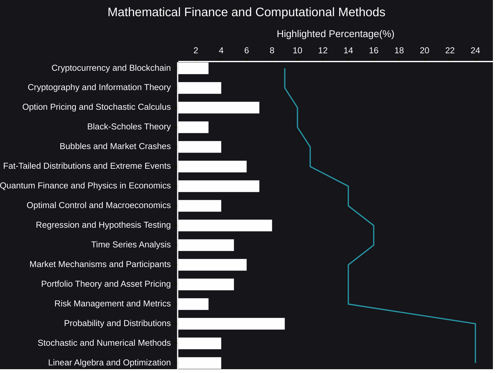

## Mathematical Finance and Computational Methods plus AI Reasoning
Mathematical finance and computational methods form the bedrock of modern financial analysis.  They provide the tools and frameworks necessary to understand, model, and manage the complex financial landscape.  This dynamic field draws upon a rich tapestry of mathematical disciplines, including stochastic calculus, probability theory, optimization, and numerical analysis, to address critical challenges in finance.

From pricing derivatives and managing risk to optimizing portfolios and forecasting market behavior, these methods are indispensable.  They allow us to quantify uncertainty, evaluate complex financial instruments, and make informed decisions in an environment characterized by constant change.

The power of mathematical finance lies in its ability to translate real-world financial problems into tractable mathematical models.  These models, often involving stochastic processes and differential equations, capture the essential dynamics of financial markets.  However, the elegance of theory must be complemented by the practicality of computation.

Computational methods play a crucial role in implementing these models.  They provide the algorithms and techniques needed to solve complex equations, simulate market scenarios, and extract meaningful insights from vast amounts of data.  Whether it's Monte Carlo simulation, numerical optimization, or time series analysis, computational tools are essential for putting mathematical finance into action.

The synergy between mathematical finance and computational methods is constantly evolving.  Advances in computing power and algorithmic development are opening new frontiers in financial modeling.  Machine learning, artificial intelligence, and big data analytics are increasingly integrated into the field, creating exciting opportunities for innovation.

This intersection of theory and practice is vital for navigating the intricacies of today's financial markets.  By combining rigorous mathematical frameworks with powerful computational tools, we can gain a deeper understanding of financial phenomena, manage risk more effectively, and ultimately make better financial decisions.  The future of finance undoubtedly rests on the continued advancement and integration of these two essential disciplines.

