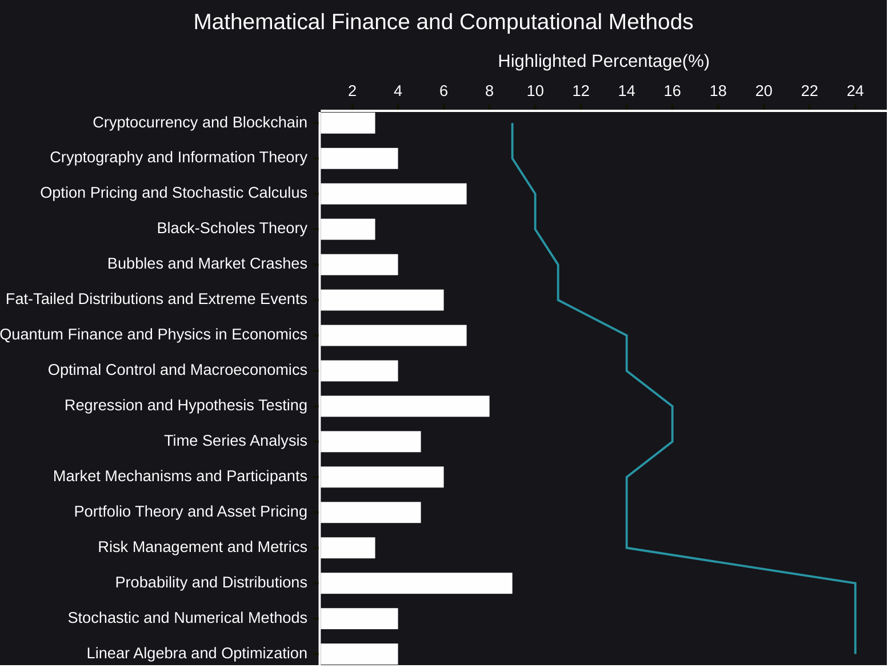

## Mathematical Finance and Computational Methods plus AI Reasoning
Mathematical finance and computational methods form the bedrock of modern financial analysis.  They provide the tools and frameworks necessary to understand, model, and manage the complex financial landscape.  This dynamic field draws upon a rich tapestry of mathematical disciplines, including stochastic calculus, probability theory, optimization, and numerical analysis, to address critical challenges in finance.

🧠[AI Reasoning](https://viadean.notion.site/Mathematical-Finance-and-Computational-Methods-plus-AI-Reasoning-1941ae7b9a3280b78b34f7ba64b32740?pvs=4)

### 🗜️Highlights

