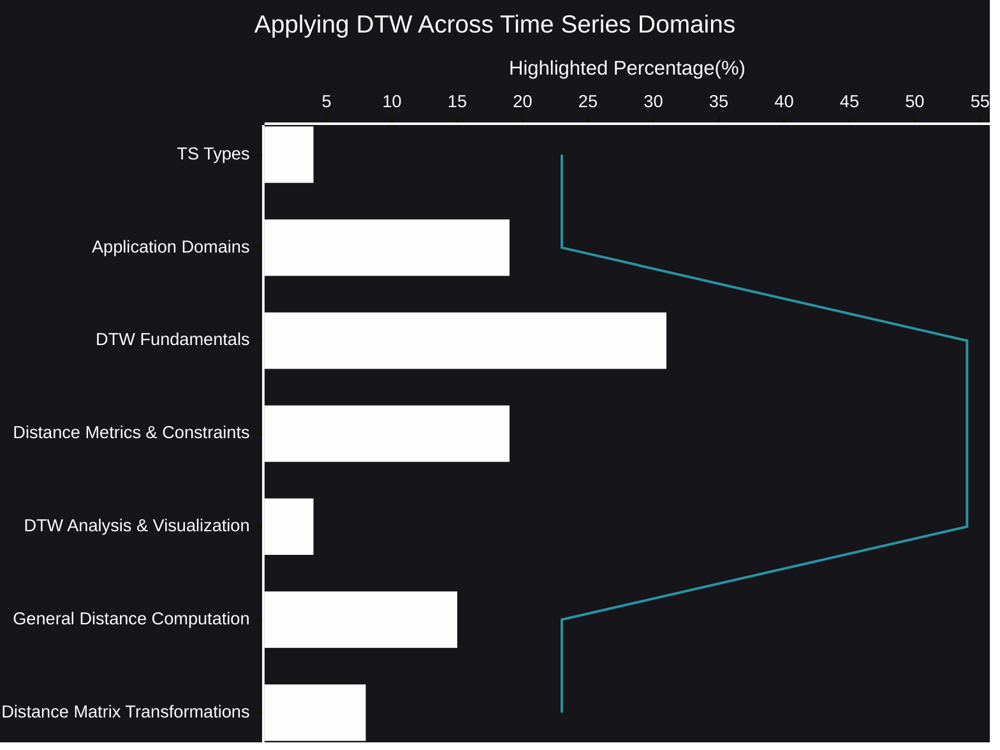

# Applying DTW Across Time Series Domains
Time series data permeates our world, from the fluctuations of stock markets to the rhythms of speech and the intricate signals of medical diagnostics. Extracting meaningful information from these temporal sequences requires robust analytical techniques. One powerful tool that stands out is Dynamic Time Warping (DTW).
- [🧠AI Insights](https://viadean.notion.site/Applying-DTW-Across-Time-Series-Domains-15e1ae7b9a3280d8b694c59e961508b5?pvs=4)
- Integrality
  - [Applied Mathematics and Statistics](https://viadean.notion.site/Applied-Mathematics-and-Statistics-1a51ae7b9a328089b257dfc0888d4fd5?pvs=4)
  - [Signal Processing](https://viadean.notion.site/Signal-Processing-1a81ae7b9a3280fe901acd63ce3428da?pvs=4)
### 🗜️Highlights

DTW offers a flexible approach to comparing and aligning time series, even when they vary in speed or timing. Unlike traditional distance metrics that demand point-by-point correspondence, DTW allows for elastic warping, accommodating variations in temporal alignment. This flexibility is critical when dealing with real-world data, where temporal distortions are common.

The power of DTW extends across diverse application domains. Whether we are analyzing the intricate patterns of multivariate medical data, comparing financial trends, or exploring the nuances of speech signals, DTW provides a means to capture the underlying similarities and differences.

Beyond simply computing distances, DTW also facilitates insightful visualizations. By examining the warping paths and cost matrices, we can gain a deeper understanding of how time series align and where temporal discrepancies occur. Furthermore, transformations applied to the distance matrix can enhance the extraction of relevant patterns.

In essence, DTW serves as a crucial bridge, enabling us to unlock the hidden relationships within time series data and gain valuable insights from the temporal flow.
