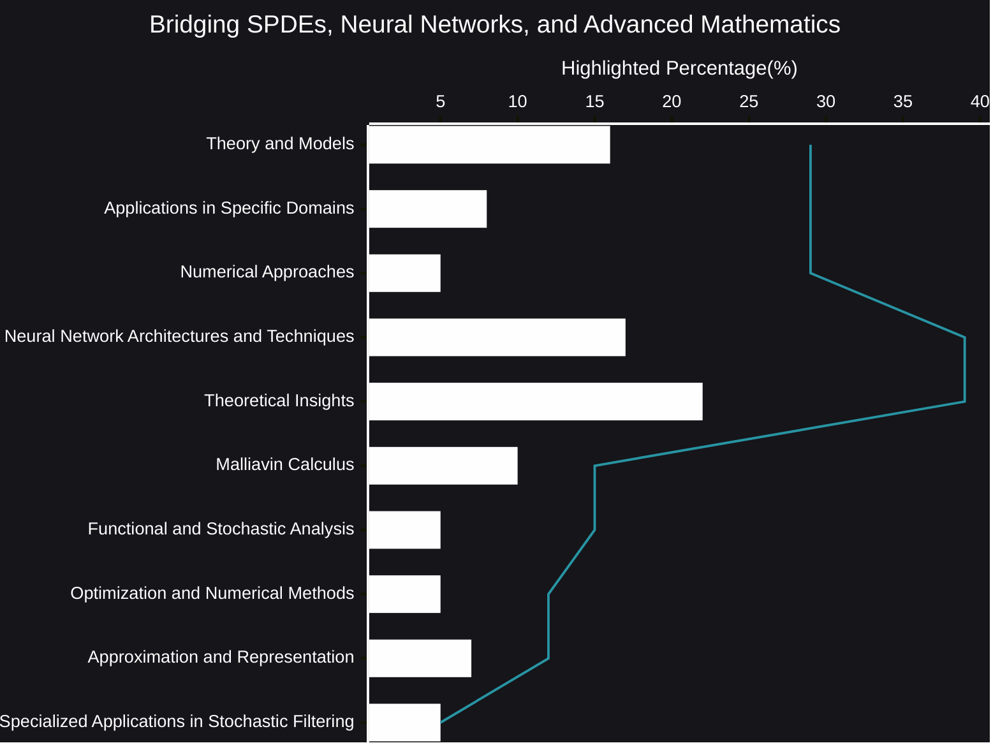

# Bridging SPDEs, Neural Networks, and Advanced Mathematics
The landscape of stochastic modeling is undergoing a profound transformation, driven by the synergistic integration of stochastic partial differential equations (SPDEs), neural networks, and advanced mathematical tools. This convergence is unlocking unprecedented capabilities in understanding and simulating complex phenomena across diverse scientific domains.
- [🧠AI Insights](https://viadean.notion.site/Bridging-SPDEs-Neural-Networks-and-Advanced-Mathematics-15f1ae7b9a328028a652d11a2900c87d?pvs=4)
- Integrality
  - [Applied Mathematics and Statistics](https://viadean.notion.site/Applied-Mathematics-and-Statistics-1a51ae7b9a328089b257dfc0888d4fd5?pvs=4)
  - [Physics](https://viadean.notion.site/Physics-1a51ae7b9a3280799b42fe620aa30907?pvs=4)
### 🗜️Highlights

Researchers are actively exploring the theoretical foundations and practical applications of SPDEs, pushing the boundaries of stochastic modeling. This involves developing sophisticated mathematical frameworks and robust numerical techniques to tackle the challenges posed by these intricate equations.

Simultaneously, the power of neural networks and machine learning is being harnessed to revolutionize the computational aspects of SPDEs. Innovative architectures and techniques are emerging, enabling the efficient and accurate approximation of solutions, even in high-dimensional settings.

Underpinning these advancements is the crucial role of advanced mathematical tools. Concepts from Malliavin calculus, functional and stochastic analysis, and approximation theory are providing essential insights into the properties and behavior of SPDEs.

This interdisciplinary endeavor is fostering a new era of stochastic modeling, where theoretical rigor and computational efficiency go hand in hand. By bridging SPDEs, neural networks, and advanced mathematics, we are gaining deeper insights into the stochastic nature of the world around us, paving the way for groundbreaking discoveries and technological innovations.
