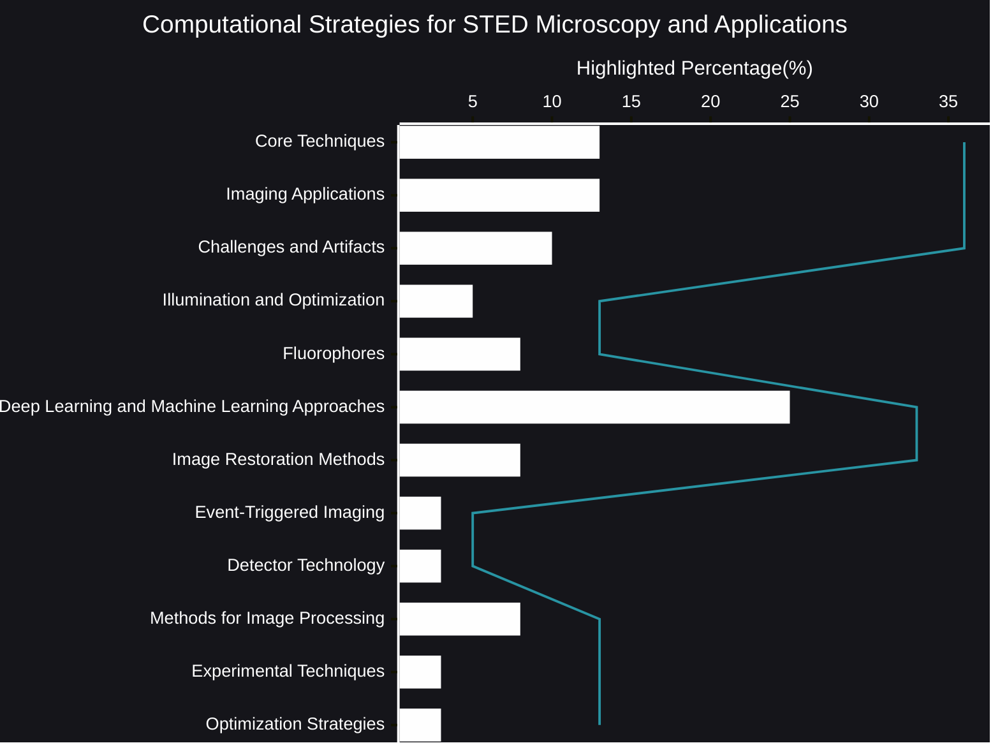

# Computational Strategies for STED Microscopy and Applications
STED (Stimulated Emission Depletion) microscopy has revolutionized our ability to visualize biological structures at the nanoscale. However, pushing the boundaries of resolution and sensitivity requires more than just advanced hardware. Computational strategies have become indispensable, acting as a crucial bridge between raw data and meaningful insights.
- [🧠AI Insights](https://viadean.notion.site/Computational-Strategies-for-STED-Microscopy-and-Applications-15f1ae7b9a32804fb0fefa18b52b0f7f?pvs=4)
- Integrality
  - [Physics](https://viadean.notion.site/Physics-1a51ae7b9a3280799b42fe620aa30907?pvs=4)
  - [Chemistry](https://viadean.notion.site/Chemistry-1a61ae7b9a3280619be3f06292d23a9f?pvs=4)
  - [Biology](https://viadean.notion.site/Biology-1a61ae7b9a3280d28f87f3cf031ab3aa?pvs=4)
🗜️Highlights

