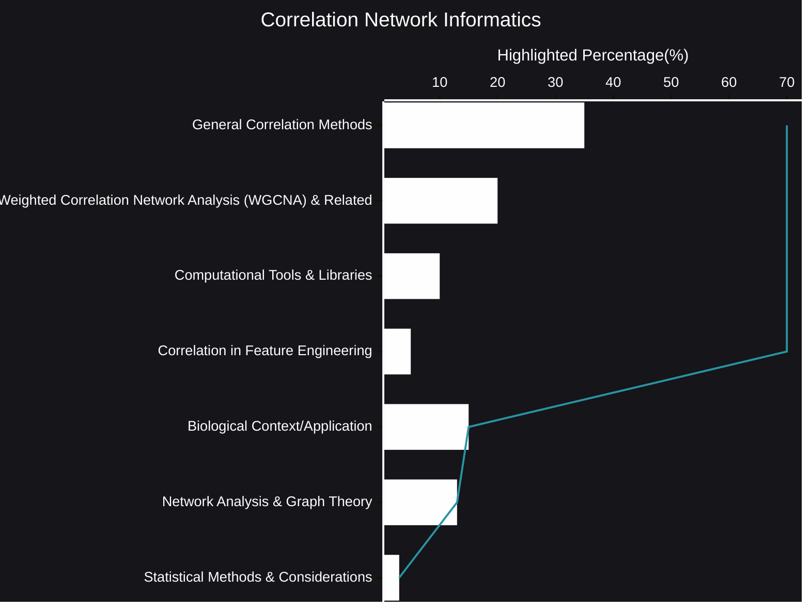

# Correlation Network Informatics
In an age of vast datasets, understanding the relationships between variables is paramount. Correlation network informatics provides a powerful lens through which we can explore these intricate connections, revealing hidden structures and driving meaningful insights across diverse domains.
- [🧠AI Insights](https://viadean.notion.site/Correlation-Network-Informatics-15f1ae7b9a328011971ccaf45cd35f82?pvs=4)
- Integrality
  - [Applied Mathematics and Statistics](https://viadean.notion.site/Applied-Mathematics-and-Statistics-1a51ae7b9a328089b257dfc0888d4fd5?pvs=4)
  - [Biology](https://viadean.notion.site/Biology-1a61ae7b9a3280d28f87f3cf031ab3aa?pvs=4)
### 🗜️Highlights

Imagine a complex web where each node represents a variable and the edges connecting them signify their relationships. Correlation network informatics allows us to construct and analyze these webs, uncovering patterns that would otherwise remain obscured. This approach extends beyond simple pairwise correlations, delving into the nuanced interactions that define systems.

The ability to construct these networks has been greatly enhanced by computational advancements. Sophisticated algorithms and tools enable us to efficiently process massive datasets, revealing the underlying architecture of complex systems. This includes the ability to identify key nodes, define communities, and discern the flow of information within the network.

Moreover, the integration of machine learning techniques, particularly graph neural networks, has revolutionized the field. These approaches allow us to learn complex patterns within networks, enabling us to predict outcomes, classify nodes, and even generate new network structures.

The applications of correlation network informatics are vast and varied. From deciphering the intricate interplay of genes in biological systems to understanding the interconnectedness of social networks, this approach provides a framework for exploring the interconnectedness of our world.

Furthermore, the rigorous application of statistical methods ensures the reliability and validity of our findings. By accounting for multiple comparisons and controlling for confounding factors, we can draw robust conclusions from our network analyses.

In essence, correlation network informatics offers a systematic and powerful approach to explore the relationships between variables, providing a deeper understanding of the complex systems that surround us.
