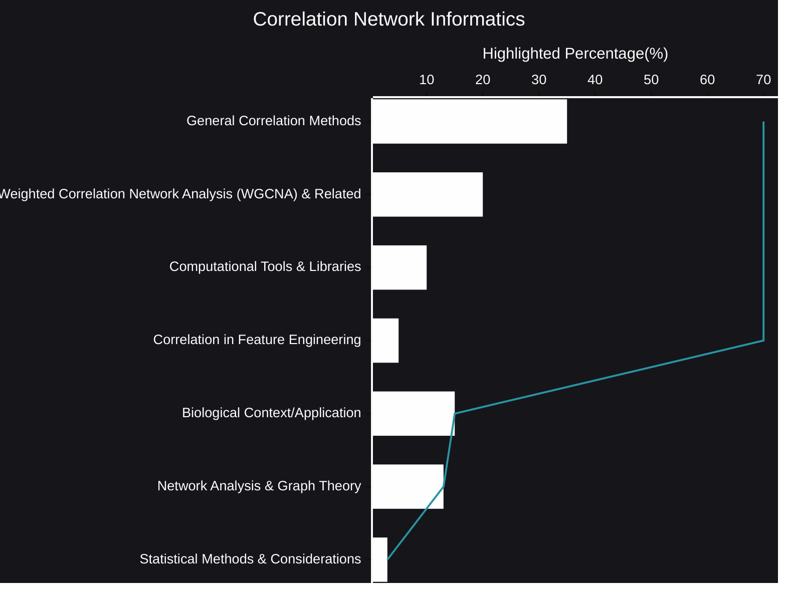

# Correlation Network Informatics
In an age of vast datasets, understanding the relationships between variables is paramount. Correlation network informatics provides a powerful lens through which we can explore these intricate connections, revealing hidden structures and driving meaningful insights across diverse domains.
- [🧠AI Insights](https://viadean.notion.site/Correlation-Network-Informatics-15f1ae7b9a328011971ccaf45cd35f82?pvs=4)
- Integrality
  - [Applied Mathematics and Statistics](https://viadean.notion.site/Applied-Mathematics-and-Statistics-1a51ae7b9a328089b257dfc0888d4fd5?pvs=4)
  - [Biology](https://viadean.notion.site/Biology-1a61ae7b9a3280d28f87f3cf031ab3aa?pvs=4)
🗜️Highlights

