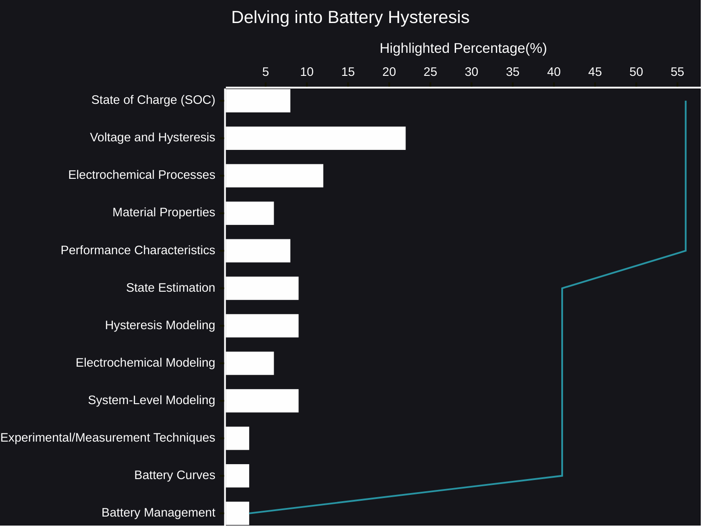

# Delving into Battery Hysteresis
The dance of energy within a battery is a complex choreography, a delicate balance of ions and electrons. We often envision a smooth, predictable flow, a direct relationship between charge and voltage. Yet, reality paints a more nuanced picture, one where the past lingers in the present, a phenomenon known as hysteresis.
- [🧠AI Insights](https://viadean.notion.site/Delving-into-Battery-Hysteresis-1651ae7b9a3280daa443fdcb83597a00?pvs=4)
- Integrality
  - [Electrochemistry](https://viadean.notion.site/Electrochemistry-1751ae7b9a32801eb009d647c2feb491?pvs=4)
  - [Physics](https://viadean.notion.site/Physics-1a51ae7b9a3280799b42fe620aa30907?pvs=4)
  - [Applied Mathematics and Statistics](https://viadean.notion.site/Applied-Mathematics-and-Statistics-1a51ae7b9a328089b257dfc0888d4fd5?pvs=4)
  - [Electrical Engineering](https://viadean.notion.site/Electrical-Engineering-1a51ae7b9a3280b28420fe77e05fe5e0?pvs=4)
  - [Materials Science](https://viadean.notion.site/Materials-Science-1a51ae7b9a328019827fd2f066e82b0f?pvs=4)
 
### 🗜️Highlights

Imagine a spring, compressed and then released. It doesn't instantly return to its original state; there's a slight delay, a lingering tension. Similarly, within a battery, the voltage doesn't precisely mirror the charge level. The path taken to arrive at a particular state influences the current voltage, creating a loop, a "hysteresis loop," on a voltage-charge graph.

This isn't merely a theoretical curiosity. It’s a tangible factor influencing battery performance, a shadow that affects everything from state-of-charge estimation to overall efficiency. In electric vehicles, for instance, this discrepancy can lead to inaccuracies in range calculations, impacting driver confidence. In portable electronics, it can affect the precision of power management, potentially leading to unexpected shutdowns.

The roots of hysteresis lie deep within the battery's electrochemical processes. The materials themselves, their intricate structures, and the very nature of ion movement contribute to this phenomenon. Phase transitions, where materials undergo structural changes during charging and discharging, are particularly susceptible. The way lithium ions interact with the electrode materials, the formation and dissolution of different phases – these are all factors contributing to the lag.

Understanding this "memory effect" is crucial for pushing the boundaries of battery technology. It's not just about creating cells that store more energy; it's about creating cells that operate with greater precision and predictability. Researchers are exploring various avenues to model and mitigate hysteresis, from developing sophisticated algorithms that account for its influence to designing new materials that minimize its impact.

This isn't a simple problem to solve. The complexity of the electrochemical environment, the interplay of multiple factors, and the inherent variability of materials make it a persistent challenge. Yet, by shedding light on this shadow within the cell, we can unlock new possibilities, paving the way for batteries that are not only more powerful but also more reliable and predictable. The future of energy storage hinges not just on raw capacity, but on the nuanced understanding of these subtle, yet significant, behaviors.
