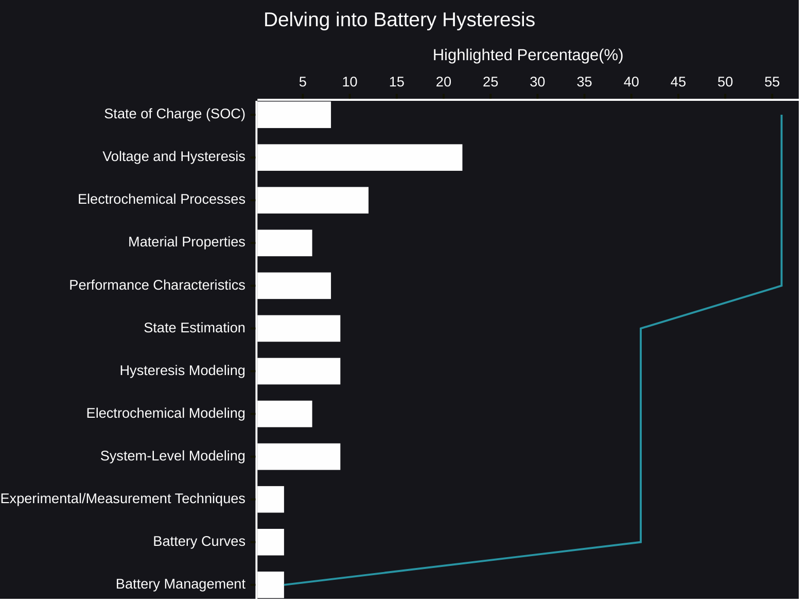

# Delving into Battery Hysteresis
The dance of energy within a battery is a complex choreography, a delicate balance of ions and electrons. We often envision a smooth, predictable flow, a direct relationship between charge and voltage. Yet, reality paints a more nuanced picture, one where the past lingers in the present, a phenomenon known as hysteresis.
- [🧠AI Insights](https://viadean.notion.site/Delving-into-Battery-Hysteresis-1651ae7b9a3280daa443fdcb83597a00?pvs=4)
- Integrality
  - [Electrochemistry](https://viadean.notion.site/Electrochemistry-1751ae7b9a32801eb009d647c2feb491?pvs=4)
  - [Physics](https://viadean.notion.site/Physics-1a51ae7b9a3280799b42fe620aa30907?pvs=4)
  - [Applied Mathematics and Statistics](https://viadean.notion.site/Applied-Mathematics-and-Statistics-1a51ae7b9a328089b257dfc0888d4fd5?pvs=4)
  - [Electrical Engineering](https://viadean.notion.site/Electrical-Engineering-1a51ae7b9a3280b28420fe77e05fe5e0?pvs=4)
  - [Materials Science](https://viadean.notion.site/Materials-Science-1a51ae7b9a328019827fd2f066e82b0f?pvs=4)
 
🗜️Highlights

