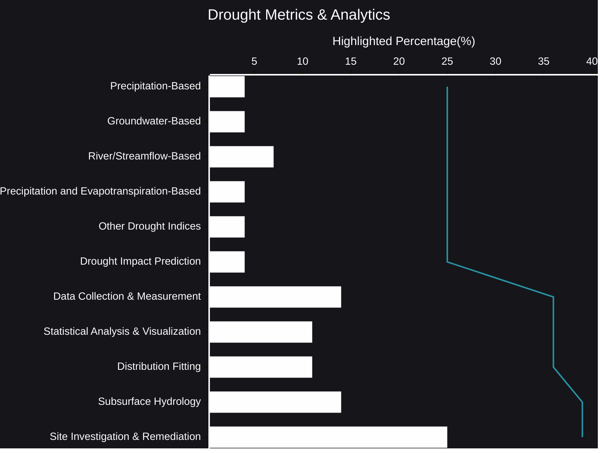

# Drought Metrics & Analytics
Droughts are complex phenomena, influencing everything from water resources to agricultural yields and ecological stability. To effectively monitor and manage these events, we need robust metrics and analytical tools. While many approaches exist, they generally fall into a few key areas.
- [🧠AI Insights](https://viadean.notion.site/Drought-Metrics-Analytics-15e1ae7b9a32807ea397dc42a4b88182?pvs=4)
- Integrality
  - [Hydrology](https://viadean.notion.site/Hydrology-1a71ae7b9a32801daebfd2ecdb35e8a3?pvs=4)
  - [Meteorology & Climatology](https://viadean.notion.site/Meteorology-Climatology-1a71ae7b9a3280ce8709d0be3119716e?pvs=4)
  - [Applied Mathematics and Statistics](https://viadean.notion.site/Applied-Mathematics-and-Statistics-1a51ae7b9a328089b257dfc0888d4fd5?pvs=4)
  - [Geology](https://viadean.notion.site/Geology-1a81ae7b9a3280fda53fde081ad440d7?pvs=4)

🗜️Highlights

