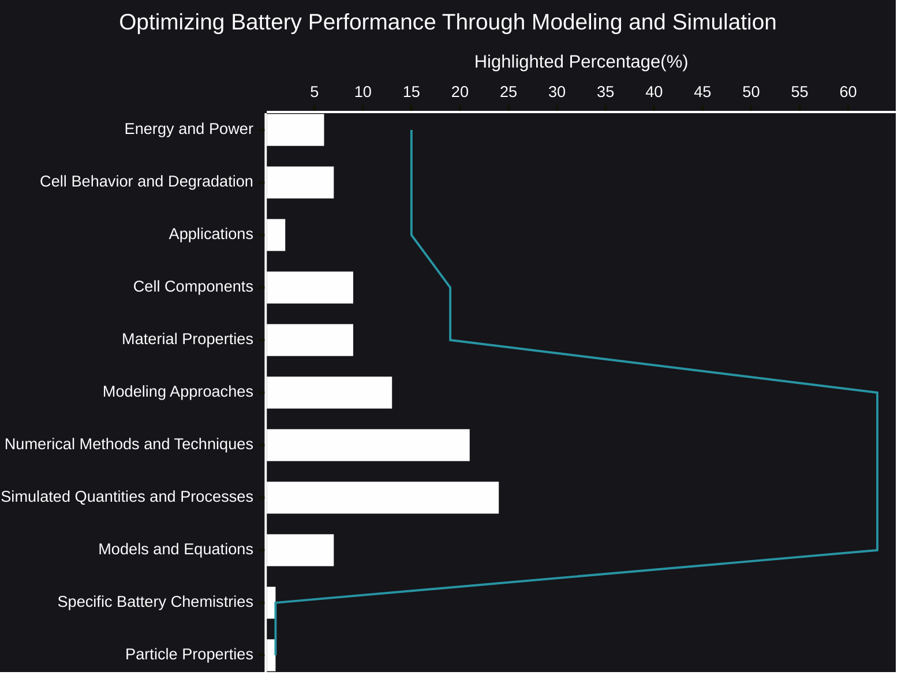

# Optimizing Battery Performance Through Modeling and Simulation
The quest for better batteries – longer life, faster charging, greater safety – is a driving force behind innovation in numerous industries. From powering our portable devices to enabling the electric vehicle revolution, batteries are the unsung heroes of modern technology. But how do we push the boundaries of battery performance? The answer lies increasingly in the realm of modeling and simulation.

- [🧠AI Insights](https://viadean.notion.site/Optimizing-Battery-Performance-Through-Modeling-and-Simulation-1651ae7b9a32801baa71c1322ca8d98c?pvs=4)
- Integrality
    - [Electrochemistry](https://viadean.notion.site/Electrochemistry-1751ae7b9a32801eb009d647c2feb491?pvs=4)
    - [Dynamics and PDEs](https://viadean.notion.site/Dynamics-and-PDEs-1881ae7b9a328019bf32df0aeae42d98?pvs=4)
    -  [Mathematics and Graph Theory](https://viadean.notion.site/Mathematics-and-Graph-Theory-17b1ae7b9a3280b29be8c7d0b6ac4c6c?pvs=4)

🗜️Highlights

