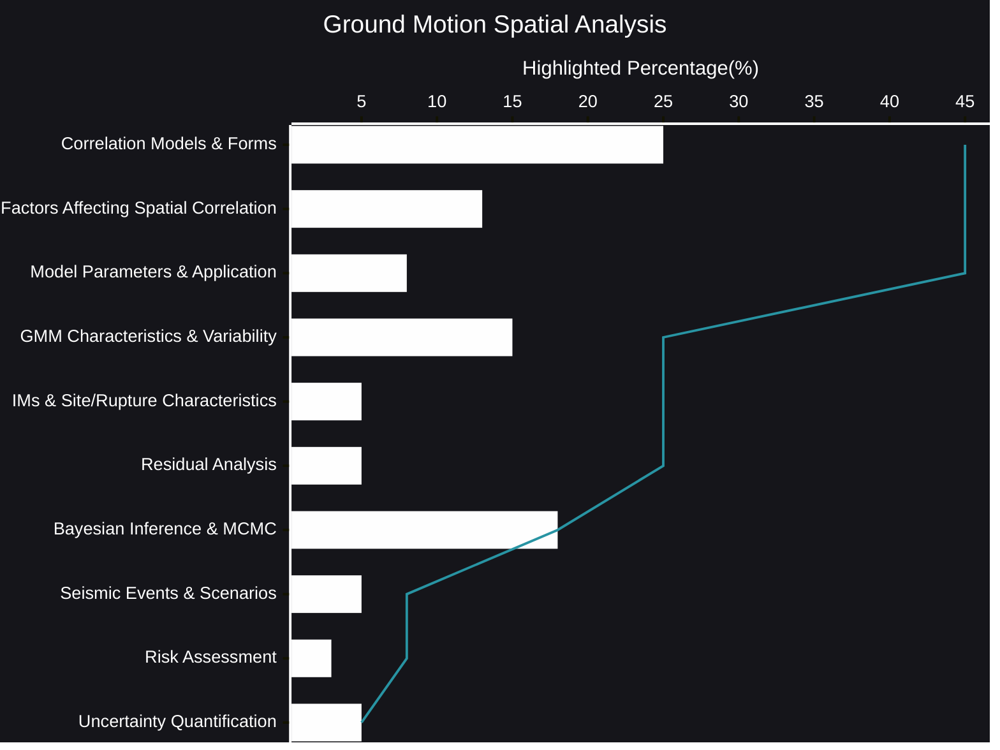

# Ground Motion Spatial Analysis
Understanding the spatial relationships between ground motions is crucial for accurately assessing seismic hazards and risks. Ground motions, far from being isolated events, exhibit complex dependencies across geographical areas. These dependencies, or spatial correlations, play a vital role in determining how seismic energy propagates and impacts structures.
- [🧠AI Insights](https://viadean.notion.site/Ground-Motion-Spatial-Analysis-15e1ae7b9a3280f9994be81e88c0e516?pvs=4)
- Integrality
  - [Geophysics](https://viadean.notion.site/Geophysics-1a81ae7b9a3280b68642e4c5b6dee072?pvs=4)
  - [Numerical Modeling](https://viadean.notion.site/Numerical-Modeling-1a81ae7b9a32808d8f9dfff03b709c30?pvs=4)
  - [Structural Engineering](https://viadean.notion.site/Structural-Engineering-1a81ae7b9a328092ae02fbcb5812d72b?pvs=4)
  - [Applied Mathematics and Statistics](https://viadean.notion.site/Applied-Mathematics-and-Statistics-1a51ae7b9a328089b257dfc0888d4fd5?pvs=4)
 
### 🗜️Highlights

