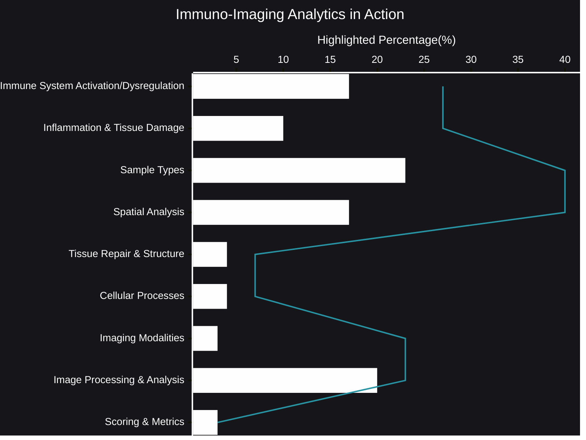

# Immuno-Imaging Analytics in Action
The intricate dance between the immune system and its environment, especially during disease, is a complex narrative written in the language of cells and tissues. Immuno-imaging analytics has emerged as a powerful tool to translate this narrative into actionable insights. By combining advanced imaging technologies with sophisticated computational analysis, we're gaining an unprecedented view of immune responses at a granular level.
- [🧠AI Insights](https://viadean.notion.site/Immuno-Imaging-Analytics-in-Action-15f1ae7b9a3280289d8ce9b0e9210d00?pvs=4)
- Integrality
  - [Immunology](https://viadean.notion.site/Immunology-1a71ae7b9a3280728a19c37ee594ca21?pvs=4)
  - [Applied Mathematics and Statistics](https://viadean.notion.site/Applied-Mathematics-and-Statistics-1a51ae7b9a328089b257dfc0888d4fd5?pvs=4)
  - [Biology](https://viadean.notion.site/Biology-1a61ae7b9a3280d28f87f3cf031ab3aa?pvs=4)
  - [Pathology](https://viadean.notion.site/Pathology-1a71ae7b9a3280d0a5eac801391d90b7?pvs=4)
  - [Imaging Science](https://viadean.notion.site/Imaging-Science-1a71ae7b9a328044a4f5ea61253b30e5?pvs=4)
### 🗜️Highlights

Imagine being able to map the battlefield of a disease, pinpointing the precise location of immune cell activation, inflammation, and tissue damage. This is the power of spatial analysis within immuno-imaging. We can now visualize how immune cells interact with their surroundings, revealing the spatial context that drives disease progression.

Beyond mere visualization, immuno-imaging analytics allows us to quantify these interactions. We can measure the extent of immune activation, the severity of inflammation, and the degree of tissue damage. This quantitative approach enables us to track disease progression, assess the effectiveness of therapies, and even predict patient outcomes.

The ability to analyze diverse biological samples, from peripheral blood to infected tissue, further enhances the power of immuno-imaging. We can gain a comprehensive understanding of immune responses across different compartments of the body, revealing systemic effects and localized pathologies.

Moreover, the integration of advanced imaging modalities, like high-parameter imaging mass cytometry, allows us to simultaneously measure a multitude of cellular markers. This high-dimensional data, coupled with sophisticated image processing and analysis techniques, unveils the intricate cellular processes that underlie immune responses.

In essence, immuno-imaging analytics is revolutionizing our understanding of immune-mediated diseases. It's not just about capturing images; it's about extracting meaningful information from those images, enabling us to decipher the body's complex battles and develop more effective therapies.
