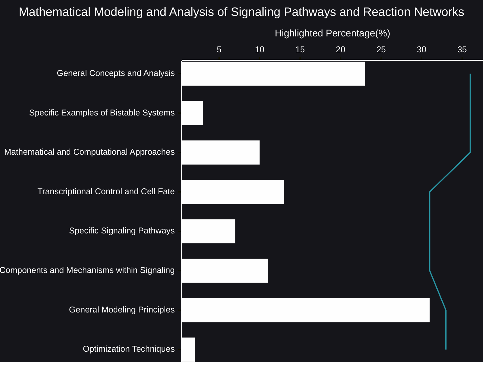

# Mathematical Modeling and Analysis of Signaling Pathways and Reaction Networks
The intricate dance of life within cells is governed by a symphony of signaling pathways and reaction networks. To truly understand these processes, researchers are increasingly turning to mathematical modeling and analysis. This approach allows us to move beyond descriptive biology and delve into the quantitative underpinnings of cellular behavior.
- [🧠AI Insights](https://viadean.notion.site/Mathematical-Modeling-and-Analysis-of-Signaling-Pathways-and-Reaction-Networks-1631ae7b9a3280108ce4e9f182eb0d93?pvs=4)
- Integrality
  - [Biology](https://viadean.notion.site/Biology-1a61ae7b9a3280d28f87f3cf031ab3aa?pvs=4)
  - [Physics](https://viadean.notion.site/Physics-1a51ae7b9a3280799b42fe620aa30907?pvs=4)
  - [Applied Mathematics and Statistics](https://viadean.notion.site/Applied-Mathematics-and-Statistics-1a51ae7b9a328089b257dfc0888d4fd5?pvs=4)
  - [Chemistry](https://viadean.notion.site/Chemistry-1a61ae7b9a3280619be3f06292d23a9f?pvs=4)

🗜️Highlights

