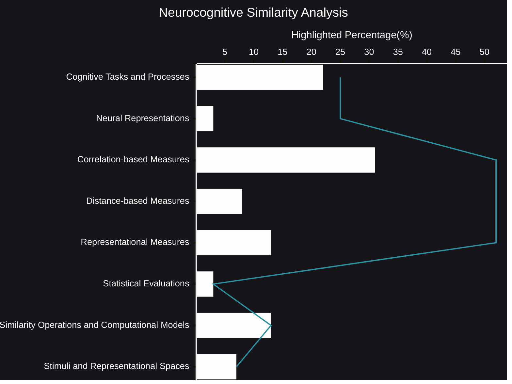

# Neurocognitive Similarity Analysis
Understanding the intricate workings of the human mind requires a multifaceted approach, one that bridges the gap between cognitive processes and their underlying neural representations. Neurocognitive similarity analysis offers a powerful framework for exploring these connections.
- [🧠AI Insights](https://viadean.notion.site/Neurocognitive-Similarity-Analysis-15b1ae7b9a32801b978deff474e0479d?pvs=4)
- Integrality
  - [Cognitive Psychology](https://viadean.notion.site/Cognitive-Psychology-1a81ae7b9a3280dcae5bc99d1af660b2?pvs=4)
  - [Applied Mathematics and Statistics](https://viadean.notion.site/Applied-Mathematics-and-Statistics-1a51ae7b9a328089b257dfc0888d4fd5?pvs=4)
  - [Neuroimaging](https://viadean.notion.site/Neuroimaging-1a81ae7b9a3280519f42f8fd420eaf57?pvs=4)
### 🗜️Highlights

