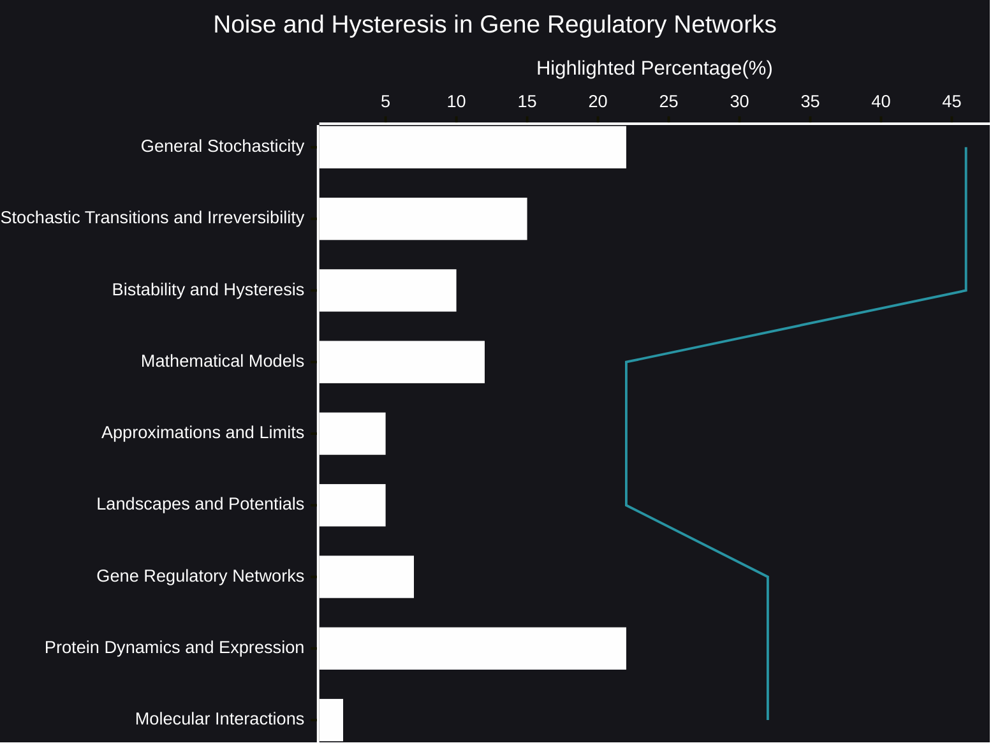

# Noise and Hysteresis in Gene Regulatory Networks
Gene regulatory networks (GRNs) are intricate systems, and understanding their behavior requires delving into the interplay of randomness and memory. Recent research highlights the significant roles of stochastic dynamics and hysteresis in shaping cellular outcomes.
- [🧠AI Insights](https://viadean.notion.site/Noise-and-Hysteresis-in-Gene-Regulatory-Networks-1641ae7b9a328026b3bccf6c31c01a04?pvs=4)
- Integrality
  - [Molecular Biology](https://viadean.notion.site/Molecular-Biology-1a61ae7b9a3280ceb322ed7c7c86015f?pvs=4)
  - [Applied Mathematics and Statistics](https://viadean.notion.site/Applied-Mathematics-and-Statistics-1a51ae7b9a328089b257dfc0888d4fd5?pvs=4)
  - [Biophysics](https://viadean.notion.site/Biophysics-1a61ae7b9a3280279db4d119c3921fcc?pvs=4)
 
### 🗜️Highlights

Stochasticity, or inherent randomness, profoundly influences GRNs, particularly when protein copy numbers are low. This randomness can lead to a variety of cell fates, even within a seemingly uniform population. Furthermore, the concept of irreversibility arises, where cells may transition to a state from which they cannot easily return, especially when faced with specific initial conditions.

Adding another layer of complexity is hysteresis, a phenomenon where a system's state depends not only on the current input but also on its history. While regulatory motifs can exhibit bistability and hysteresis, their compatibility with intrinsic noise remains a key area of investigation. The impact of hysteresis extends to significant biological processes, such as cancer metastasis.

Mathematical modeling plays a crucial role in dissecting these phenomena. Tools like the chemical master equation (CME) and the construction of energy potential-like landscapes offer insights into the probability distributions and transition rates within GRNs. However, approximations and limits must be considered, especially when dealing with systems approaching the thermodynamic limit.

The study of gene expression and regulation further reveals the dynamic nature of protein production. Protein bursting, where proteins are produced in bursts, is a common occurrence, and the temporal evolution of these bursts can be tracked using probability density functions. The interplay between mRNA and protein degradation rates, as well as molecular interactions described by functions like the Hill function, adds to the complexity of these networks.

Ultimately, understanding the intricate dance between stochasticity and hysteresis is essential for unraveling the mechanisms governing gene regulatory networks and their impact on cellular behavior.
