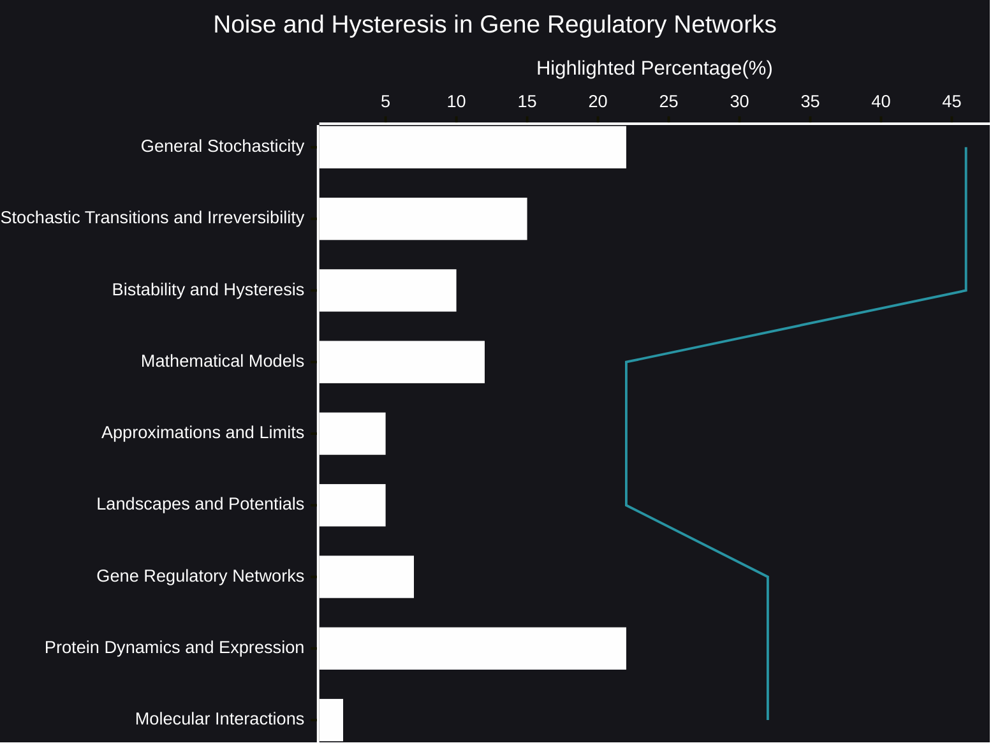

# Noise and Hysteresis in Gene Regulatory Networks
Gene regulatory networks (GRNs) are intricate systems, and understanding their behavior requires delving into the interplay of randomness and memory. Recent research highlights the significant roles of stochastic dynamics and hysteresis in shaping cellular outcomes.
- [🧠AI Insights](https://viadean.notion.site/Noise-and-Hysteresis-in-Gene-Regulatory-Networks-1641ae7b9a328026b3bccf6c31c01a04?pvs=4)
- Integrality
  - [Molecular Biology](https://viadean.notion.site/Molecular-Biology-1a61ae7b9a3280ceb322ed7c7c86015f?pvs=4)
  - [Applied Mathematics and Statistics](https://viadean.notion.site/Applied-Mathematics-and-Statistics-1a51ae7b9a328089b257dfc0888d4fd5?pvs=4)
  - [Biophysics](https://viadean.notion.site/Biophysics-1a61ae7b9a3280279db4d119c3921fcc?pvs=4)
 
🗜️Highlights

