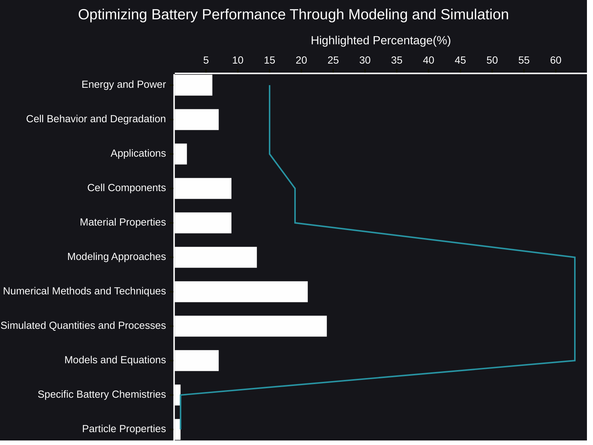

# Optimizing Battery Performance Through Modeling and Simulation
The quest for better batteries – longer life, faster charging, greater safety – is a driving force behind innovation in numerous industries. From powering our portable devices to enabling the electric vehicle revolution, batteries are the unsung heroes of modern technology. But how do we push the boundaries of battery performance? The answer lies increasingly in the realm of modeling and simulation.

- [🧠AI Insights](https://viadean.notion.site/Optimizing-Battery-Performance-Through-Modeling-and-Simulation-1651ae7b9a32801baa71c1322ca8d98c?pvs=4)
- Integrality
    - [Electrochemistry](https://viadean.notion.site/Electrochemistry-1751ae7b9a32801eb009d647c2feb491?pvs=4)
    - [Dynamics and PDEs](https://viadean.notion.site/Dynamics-and-PDEs-1881ae7b9a328019bf32df0aeae42d98?pvs=4)
    -  [Mathematics and Graph Theory](https://viadean.notion.site/Mathematics-and-Graph-Theory-17b1ae7b9a3280b29be8c7d0b6ac4c6c?pvs=4)

### 🗜️Highlights

Imagine trying to design a complex engine without any blueprints or computer simulations. You'd be relying on trial and error, a costly and time-consuming process. The same principle applies to batteries. While physical experiments are essential, they alone cannot provide the detailed understanding needed to optimize performance. This is where modeling and simulation step in.

By creating virtual representations of batteries, researchers can delve into the intricate processes happening within the cell. They can visualize the flow of ions, the distribution of electrical potential, and the development of mechanical stresses. This level of insight is simply not attainable through traditional experimental methods.

Think of it as having a microscopic window into the battery's inner workings. Instead of blindly adjusting parameters, engineers can now perform virtual experiments, testing different materials, designs, and operating conditions. They can explore the impact of particle size, electrode porosity, and electrolyte composition, all without building a single physical prototype.

This ability to "see" inside the battery allows for a deeper understanding of degradation mechanisms. Researchers can identify the root causes of capacity fade and develop strategies to mitigate them. They can explore the effects of temperature, charge/discharge rates, and other factors that influence battery lifespan.

Furthermore, modeling and simulation enable the design of safer batteries. By simulating extreme conditions, such as overcharging or short circuits, researchers can identify potential failure modes and develop safety features to prevent them. This is crucial for applications where battery safety is paramount, such as electric vehicles and aerospace.

The power of modeling and simulation extends beyond the design phase. It can also be used to optimize battery management systems, which control charging and discharging. By simulating different usage patterns, engineers can develop algorithms that maximize battery life and performance.

In essence, modeling and simulation are transforming battery development from an art to a science. They provide a powerful tool for understanding, optimizing, and ultimately, revolutionizing battery technology. By embracing this approach, we can accelerate the development of next-generation batteries that are more powerful, longer-lasting, and safer than ever before.

