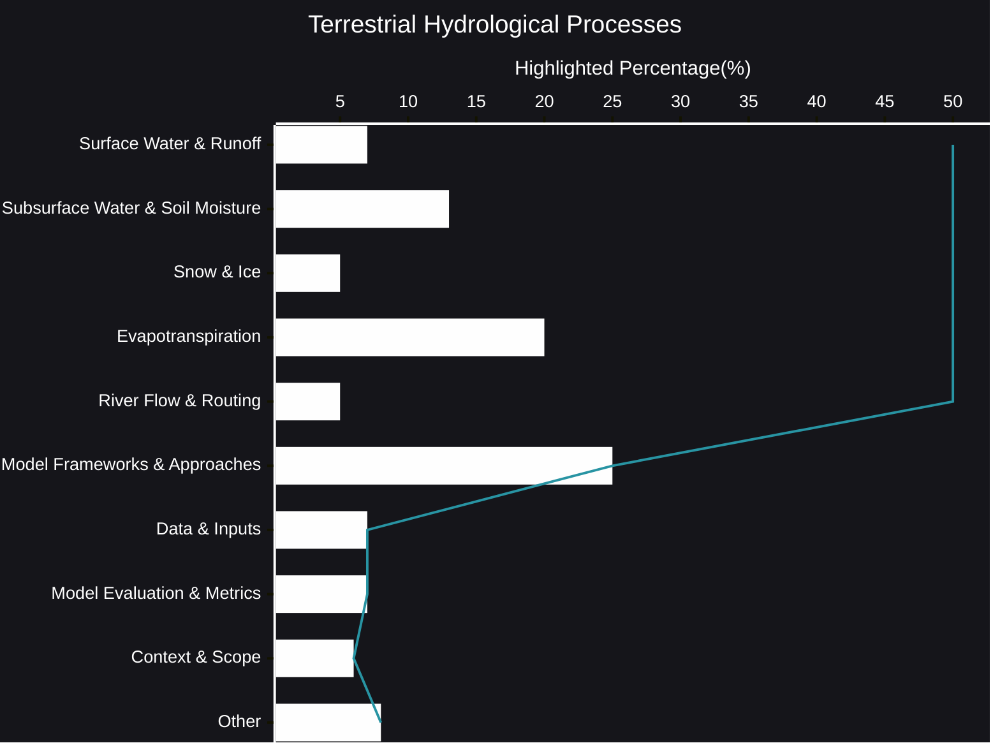

# Terrestrial Hydrological Processes
The movement of water across our planet's land surface is a complex and dynamic process, shaping ecosystems, influencing climate, and impacting human societies. Terrestrial hydrology seeks to understand and model this intricate dance of water, from the moment it falls as precipitation to its eventual return to the oceans.
- [🧠AI Insights](https://viadean.notion.site/Terrestrial-Hydrological-Processes-15e1ae7b9a32809eb13afbf3eb31d955?pvs=4)
- Integrality
  - [Hydrology](https://viadean.notion.site/Hydrology-1a71ae7b9a32801daebfd2ecdb35e8a3?pvs=4)
  - [Applied Mathematics and Statistics](https://viadean.notion.site/Applied-Mathematics-and-Statistics-1a51ae7b9a328089b257dfc0888d4fd5?pvs=4)
  - [Physics](https://viadean.notion.site/Physics-1a51ae7b9a3280799b42fe620aa30907?pvs=4)
  - [Meteorology & Climatology](https://viadean.notion.site/Meteorology-Climatology-1a71ae7b9a3280ce8709d0be3119716e?pvs=4)
### 🗜️Highlights

At the heart of this discipline lies the study of fundamental processes. We delve into the mechanisms that govern how water moves across the land surface, from the flow of rivers and streams to the infiltration of water into the soil. Understanding the interplay between surface runoff and subsurface flow is crucial for predicting flood risks and managing water resources.

The role of soil moisture is also paramount. We explore how water is stored and transported within the soil, influencing plant growth, evaporation, and groundwater recharge. In regions where snow and ice dominate, we investigate the processes of snow accumulation, melt, and glacier dynamics, which play a significant role in regulating river flow.

Evapotranspiration, the combined process of evaporation and plant transpiration, is another critical component. We examine how water is returned to the atmosphere, influencing the water balance and atmospheric moisture content.

To capture the complexity of these processes, sophisticated hydrological models are developed and applied. These models integrate our understanding of physical processes with observational data to simulate the movement of water across the landscape. They serve as valuable tools for assessing the impacts of climate change, predicting water availability, and informing water management decisions.

The accuracy of these models relies on a range of input data, including meteorological observations, topographic information, and land cover characteristics. Evaluating model performance is essential, and various metrics are used to assess how well the models reproduce observed hydrological patterns.

Ultimately, the study of terrestrial hydrological processes provides critical insights into the functioning of our planet's water cycle. By advancing our understanding of these processes, we can better manage water resources, mitigate the impacts of extreme events, and ensure the sustainability of our water-dependent ecosystems.
