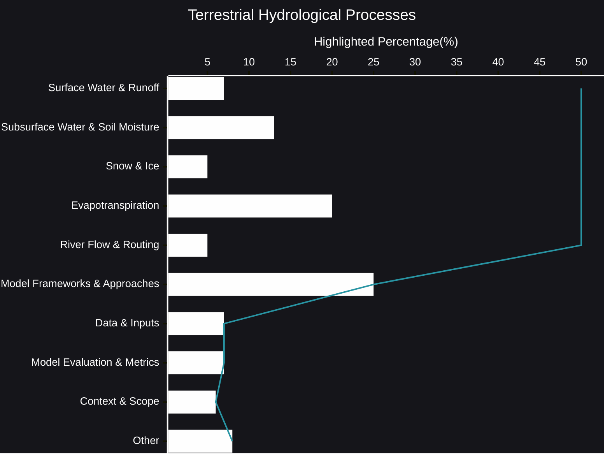

# Terrestrial Hydrological Processes
The movement of water across our planet's land surface is a complex and dynamic process, shaping ecosystems, influencing climate, and impacting human societies. Terrestrial hydrology seeks to understand and model this intricate dance of water, from the moment it falls as precipitation to its eventual return to the oceans.
- [🧠AI Insights](https://viadean.notion.site/Terrestrial-Hydrological-Processes-15e1ae7b9a32809eb13afbf3eb31d955?pvs=4)
- Integrality
  - [Hydrology](https://viadean.notion.site/Hydrology-1a71ae7b9a32801daebfd2ecdb35e8a3?pvs=4)
  - [Applied Mathematics and Statistics](https://viadean.notion.site/Applied-Mathematics-and-Statistics-1a51ae7b9a328089b257dfc0888d4fd5?pvs=4)
  - [Physics](https://viadean.notion.site/Physics-1a51ae7b9a3280799b42fe620aa30907?pvs=4)
  - [Meteorology & Climatology](https://viadean.notion.site/Meteorology-Climatology-1a71ae7b9a3280ce8709d0be3119716e?pvs=4)
🗜️Highlights

