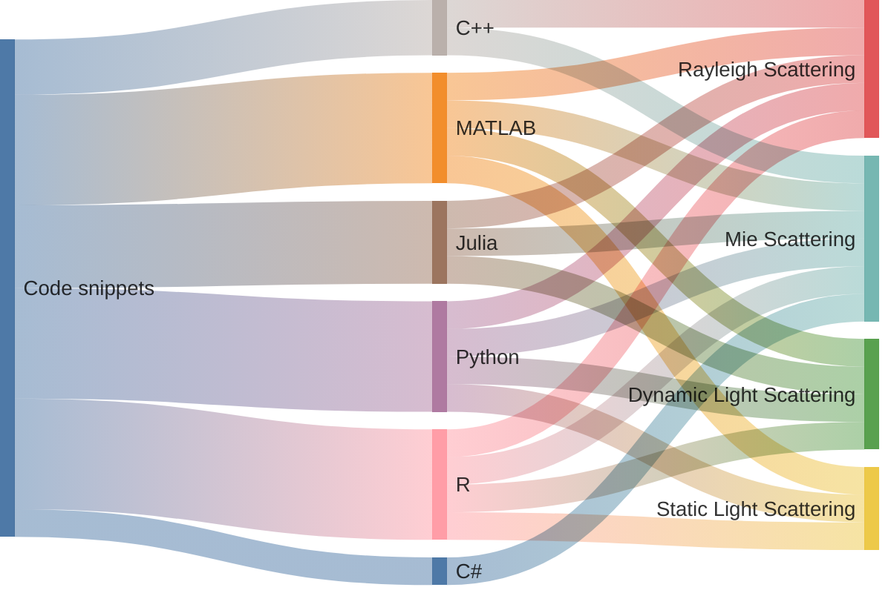

# :ocean:viadean.notion.site
[Light scattering of colloids](https://viadean.notion.site/Light-scattering-of-colloids-13b1ae7b9a328016b416d9d271ea55c3)

## 🎏Bilingue
- Code snippets to Rayleigh Scattering
  - MATLAB和Python及R瑞利散射
- Code snippets to Mie Scattering
  - MATLAB和Python及C++米氏散射

